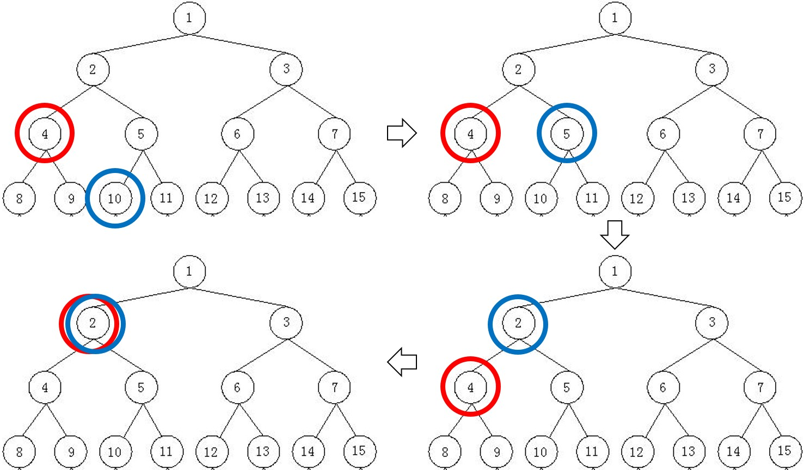

# 第三阶段编程练习2

本次作业主要在练习递归。递归的题目一般具备如下的两个特征：1) 具有明显的状态，且状态之间有明显的跳转，和2) 具有明显的终止条件。完成递归地题目，一般也都会需要从这两个特征来入手考虑。

一个递归函数，一般而言可以分成4个部分：1) 状态定义，2) 终止条件，3) 当前状态计算，和4) 状态转移。举个例子，在第三阶段编程练习1中的“拔牙”这道题目，就是典型的递归题目，可以使用递归来轻松完成。对该递归函数的比较详细的解析如下。

```cpp
/***
状态定义
    当前状态由剩下的牙数left和已经找到的方案数cnt共同定义
    这样的定义使得状态在整个递归过程中是唯一的
***/
int func(int left, int cnt)
{
/***
终止条件
    在状态转移之前，需要判断当前状态是否需要终止，不同的终止条件有不同的返回值，视实际情况而定
    该题目有两个终止条件——left为负和left为零，分别对应不存在方案和找到新方案
***/
    if (left < 0)
        return cnt;
    if (left == 0)
        return cnt + 1;
/***
当前状态计算
    该题目中不需要在当前状态进行计算
    本次作业中的一些题目会有这一步骤
***/
/***
状态转移
    从当前的(left, cnt)状态，存在两种可能的跳转，分别对应拔1颗和2颗牙
    跳转后的状态分别为(left-1, func(left-1, cnt))和(left-2, func(left-2, cnt))
    最后返回方案数cnt即可
***/
    cnt = func(left - 1, cnt);
    cnt = func(left - 2, cnt);
    return cnt;
}
```

当然，没有硬性的规定来要求递归函数一定要这样实现，但是根据实际的编程情况来看，这是一种比较符合人的思维方式也比较简单的实现方法。

## 查看菌落数目

该题目的递归在于如何避免重复计数。一个比较很直观的想法是，当对一个细菌计数后，就把整个菌落标记，不再对其他同菌落中的细菌计数。细菌的位置标记为OCP，没有的位置标记为EMP，且按照题目要求，同一个菌落中的细菌必须是通过上下左右四个方向的邻居可以连通的，那么标记菌落的递归函数如下。

```cpp
void func(int i, int j) // 状态为位置(i, j)
{
    int di[4] = {-1, 1, 0, 0}, dj[4] = {0, 0, -1, 1};
    if (i < 0 || i >= n || j < 0 || j >= m) // 终止条件1，当前位置出界
        return;
    if (arr[i][j] != OCP)                   // 终止条件2，当前状位置没有细菌
        return;
    arr[i][j] = EMP;    // 标记当前位置为没有细菌（EMP）
    for (int d = 0; d < 4; d++)
        func(i+di[d], j+dj[d]);     // 向上下左右四个方向转移
    return;
}
```

该函数将同一个菌落内的细菌全部清除（标记为EMP），从而避免了重复计数。只需要对矩阵扫描，每遇到细菌便计数并调用func清除整个菌落即可完成题目。

## 孙悟空找师傅

该题目的递归在于如何向四面八方探索找路，其实本质上是之前提过的深度优先搜索（DFS）。在地图中，可以走且还未走过的格子标记为ROAD，墙标记为WALL，悟空走过的格子标记为VISITED，师傅所在的格子标记为GOAL。考虑从悟空的初始位置起，不断地朝上下左右四个方向探索，若最终能走到GOAL，就说明可以找到；否则不可能。探索的递归函数如下。

```cpp
bool func(int i, int j) // 状态为位置(i, j)
{
    bool ret = false;
    int di[4] = {-1, 1, 0, 0}, dj[4] = {0, 0, -1, 1};
    for (int d = 0; d < 4; d++)
    {
        int _i = i + di[d], _j = j + dj[d]; // 探索四个方向
        if (_i < 0 || _i >= m || _j < 0 || _j >= n) // 出界，不能探索
            continue;
        if (arr[_i][_j] == GOAL)                    // 找到GOAL，终止探索
            return true;
        if (arr[_i][_j] != ROAD)                    // 不是ROAD，不能探索
            continue;
        arr[_i][_j] = VISITED;  // (i, j)已经走过，标记为VISITED
        ret = ret || func(_i, _j);
        if (ret)
            return ret;
    }
    return ret;
}
```

从悟空初始的位置(x, y)起，调用func(x, y)即可。

## 排队游戏

该题目实质上就是集体作业1中的“一类括号匹配问题”，关于匹配的部分不再赘述，可以使用之前介绍的栈的方法也可以使用递归进行。

除了匹配括号之外，唯一的难点在于分别记录男孩和女孩的符号。实际上只需要与字符串第一个字符比较即可，若相同则为男孩，否则为女孩。

## 字符串p型编码

该题目不需要递归，边扫描字符串边输出即可。扫描的同时，记录之前的连续字符，以及出现的次数，一旦扫描到的字符发生改变则输出并更新记录的字符和次数（1次），直到最后输出最终的记录并换行。

## 二叉树

该题目的递归在于如何找到离两个节点最近的共同父节点。

为了方便操作，介绍一下如何快速计算一个节点的父节点和子节点。如下图标号的一棵满二叉树，根节点为1；对于非叶节点i，它的两个子节点非别为2 * i和2 * i + 1；对于非根节点i，它的父节点为i / 2向下取整。可以用除2来快速求取一个节点的父节点之后，便可以来求取两个节点的最近共同父节点。考虑例子如下表。



初始状态下，需要查找4和10的共同父节点，由于4 < 10，所以红色圈与蓝色圈同层或在蓝色圈之上的某层，那么蓝色圈可以向上走一层，到达10的父节点，也就是5（第一个箭头）。这样就得到了与4和10的共同父节点等价的问题——查找4和5的共同父节点，接下来还是4 < 5，蓝色圈继续向上走，到达2（第二个箭头）。之后，4 > 2，这意味着红色圈落后，需要向上走一层，红色圈向上走，到达2（第三个箭头）。最终，红色圈和蓝色圈相遇，说明找到了4和10的共同父节点，由于这是第一次相遇，该节点是最近的共同父节点。

明白了上面的例子之后，可以再来看递归函数如下。

```cpp
int func(int x, int y)
{
	if (x == y)     // 找到了最近的共同的父节点
		return x;   // 直接返回相遇的节点
	else if (x > y)             // x比y深
		return func(x / 2, y);  // x向上走一层
	else if (x < y)             // y比x深
		return func(x, y / 2);  // y向上走一层
}
```

## 放苹果

该题目的递归在于如何将放苹果的问题化为若干个子问题进行求解。由于1 5 1和1 1 5和5 1 1是同一种放法，使得直接搜索很难进行。

首先，先考虑一些边界情况的子问题如下。

1. 没有盘子也没有苹果（m = n = 0）。这种情况下，恰好放完了，有一种放法。

2. 只有盘子没有苹果（n > 0且m = 0）。这种情况下，只有每个盘子都空的一种放法。

3. 没有盘子只有苹果（n = 0且m > 0）。这种情况下，没法放苹果，因此不存在任何一种放法。

很明显，1和2是可以合并的，即m = 0时，就只有一种放法。而只要m和n满足上面情况之一，就可以直接作出判断。接下来，考虑一下盘子和苹果的数量关系的影响，如下。

1. 盘子多于苹果（n > m）。这种情况下，根据鸽巢原理，任何一种放法都会有至少n - m个盘子是空的，因此可以提前直接去掉n - m个盘子，直接用m个盘子来放m个苹果即可。

2. 苹果多于盘子（m > n）。这种情况下，情况会比较复杂——有的盘子可以空着，有的盘子可以放多个苹果。

这其中的1可以直接简化，2需要进一步来考虑。由于1 5 1和1 1 5和5 1 1是同一种放法这种题目要求的存在，我们在考虑这个问题时不能是搜索的（搜索会有顺序，而题目要求里不考虑顺序）。对于m > n的情况下，其实只有两种选择——空一个盘子或者一个盘子都不空，如下。

1. 空一个盘子。这种选择下，n个盘子放m个苹果且空一个盘子，就等价于n - 1个盘子放m个苹果。因而这一选择下可以对问题进行化简。

2. 一个盘子都不空。这种选择下，n个盘子每个都至少要先放一个平哥，那么n个盘子放m个苹果且一个盘子都不空，就等价于n个盘子放m - n个苹果。因而这一选择下也可以对问题进行化简。

最后，需要证明上述的化简方法是完备的，没有遗漏任何一种情况，这一证明略过。整个算法的递归实现如下。

```cpp
int func(int m, int n)  // m个苹果，n个盘子
{
    if (n > m)  // 盘子比苹果多
        return func(m, m);
    if (m == 0)     // 没有苹果了
        return 1;   // 只有空着盘子一种放法
    if (n == 0)     // 没有盘子了
        return 0;   // 不存在放法
    return func(m, n-1) // 空着一个盘子的方法
        + func(m-n, n);  // 每个盘子各放一个苹果的方法
}

```

## 集合里的乘法

该题目直接使用递归来求解，递归函数中可以直接选择是否乘上目前的数字。递归函数如下。

```cpp
bool func(int idx, long long mul)   // 第idx个数，当前乘积为mul
{
    if (idx >= n)       // 超出范围
        return false;
    if (mul == goal)    // 找到可行的方案
        return true;
    if (func(idx + 1, mul * num[idx]))  // mul里算上第idx个数的方案
        return true;
    return func(idx + 1, mul);  // mul里不算第idx个数的方案
}
```