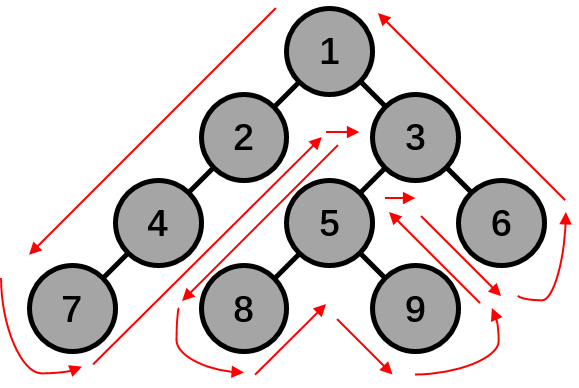

# 第三阶段编程练习4

本次作业主要练习了深度优先搜索，旅行商问题进一步要求剪枝。

利用递归函数进行深度优先搜索（DFS），在之前的作业中已经有所练习。典型的DFS就是二叉树的结点遍历，如下例子所示，灰色的是一棵二叉树（每个节点都至多有两个分叉/子节点的树），红色剪头为DFS的遍历顺序，这个例子中会走过所有9个节点，路过节点的顺序是1-2-4-7-4-2-1-3-5-8-5-9-5-3-6-3-1。



任何可以使用DFS解决的问题都可以被表示成树的形式，在判断元素一题中将进行说明。利用DFS求解问题，本质上就是在问题的树上进行遍历搜索。

然而，暴力地对树进行搜索往往会很慢。在于很多情况下，当我们搜索到树中的某个节点时，可以根据一些历史记录直接判断这个节点以下的所有情况都不满足要求——这样的话，我们可以在这样的节点直接终止向下搜索，一般情况下这会使得搜索效率大幅度提高。

利用上面的例子，假设我们已经走过1-2-4-7-4-2-1-3-5，即此时是我们第一次到达5这个节点。假设我们可以有某种方式计算出5以下所有情况（即8和9）的数值都小于已知的7（假设我们在求解一个最大化问题），那么就可以直接终止，不去搜索8和9，而返回3去搜索6。这样的话，剪枝后路过节点的顺序是1-2-4-7-4-2-1-3-5-3-6-3-1，比之前要短。实际中的问题的树分支更多，高度也更高，所以剪枝后的搜索路径会更短，搜索效率会更高。

## 质因数分解

该题目显然分为两步：(1) 求取质数，和(2) 质因数分解。质数可以利用之前介绍的筛法完成，筛法求取is_prime数组的代码如下。

```cpp
bool is_prime[MAX_N] = {false};
memset(is_prime + 2, 0xff, sizeof(bool) * (MAX_N - 2));
for (int i = 2; i <= num; i++)
    if (is_prime[i])
        for (int j = i + i; j <= num; j += i)
                is_prime[j] = false;
```

之后利用is_prime数组对num进行质因数分解，代码如下。

```cpp
for (int i = 2; i <= num; i++)
    if (is_prime[i])
        while (num % i == 0)
        {
            num /= i;
            // 输出i
        }
```

经过简单思考就可以发现，这两部分代码可以合为一部分，即求取质数的过程中，每找到一个质数就利用它对num进行质因数分解。按这个思路便可以得到提供的示例代码。

## 判断元素

该题目显然是需要进行深度优先搜索。为了加速计算，我们也需要进行一些简单的剪枝。

举个例子，已知0在M，求取32是否在M之中，整个问题的搜索树如下，每个节点y的两个子节点分别对应2y+1和3y+1。搜索过程中的终止条件为，若当前节点y>32，则终止该节点y的搜索——因为显然y的所有子孙节点都会大于32，而不可能搜索到32（图中红色×表示终止）。


除了终止条件，还有一个重要的剪枝条件，在图中用紫色×表示。10的子节点31被终止，是因为在此前已经搜索到过31，无论之前的搜索31的结果如何，这一次再搜索31也只是在重复之前的过程，因此不必再向下搜索了；同理，0的子节点1也被终止，因为1已经在之前搜索过了。按上图的方法，可以得到答案——32不在M中。

看过例子之后，我们总结一下该题目的递归算法。

```
为了求解x是否在M之中，使用函数func搜索的过程中，到了节点y时
1. 若y == x，则x在M之中，终止；
2. 若y > x，则y的所有子孙节点都比x大，没有必要搜索，终止；
3. 若y在visit数组中记录过，则此前到达过y，那么就不需要再次搜索y，终止；
4. 递归调用func搜索2y+1并记录visit数组
    4.1 递归调用func(2y+1)
    4.2 将2y+1加入到visit数组中
5. 递归调用func搜索3y+1并记录visit数组
    5.1 递归调用func(3y+1)
    5.2 将3y+1加入到visit数组中
```

最后，在提供的示例代码之中，额外地使用了指针来在递归函数中传递visit数组。感兴趣的同学可以自行学习指针的相关用法，若存在困难，也可以使用之前作业示例中使用的全局变量的方法。

## 迷宫

二维地图上的搜索问题，直接参考提供的代码即可，不再赘述。

## 选择你喜欢的水果

该题目是比较简单的字符串问题。每行文字中至多有一个水果，那么我们只需要搜索7种水果在字符串中出现的位置即可。若找到了出现的位置，便可以分段输出字符串；否则输出题目要求的不存在的情况下的字符串。

求字符串b在字符串a中第一次出现的位置，可以直接使用\<cstring\>库中的strstr(a, b)函数。该函数返回字符指针，指向第一次出现的位置；若b在a中没有出现，那么返回空指针NULL。

## 图案计数

二维地图上的搜索问题，直接参考提供的代码即可，不再赘述。

## 红与黑

二维地图上的搜索问题，直接参考提供的代码即可，不再赘述。

## 有理数树

该题目虽然看起来像是一棵前面介绍的树，但是实际求解时并不需要从上向下搜索，相反的，我们直接从目标的位置向上递归直至1/1即可。

对于一个节点p/q来说，若p < q，那么这个节点一定是在父节点的左边的子节点上，其父节点为p/(q-p)；否则在父节点的右边的子节点上，其父节点为(p-q)/q。接下来，我们考虑编号的问题，假设一个节点的编号为x，那么其左子节点的编号为2x，右子节点的编号为2x+1。综合考虑递归的情况，便可以得到递归函数如下。

```cpp
int func(int p, int q)
{
    if (p == 1 && q == 1)
        return 1;
    if (p < q)
        return 2 * func(p, q - p);
    else
        return 2 * func(p - q, q) + 1;
}
```

## 平衡矩阵

第三阶段编程练习3中的原题，不再赘述。

## 排队游戏

第三阶段编程练习2中的原题，不再赘述。

## 旅行售货商问题

旅行商问题（TSP，Traveling Salesman Problem）是一个经典的NP完全问题，在之后的学习中会多次学到TSP。NP完全问题就意味着TSP无法在多项式时间内求解，即TSP的复杂度非常高。

我们可以从简到繁，尝试直接暴力DFS搜索，代码如下。起点的问题不需要考虑的，因为最佳的路径是一个环，可以从任意一点开始。这个DFS复杂度非常高，是O(n!)的，在题目数据量下（n <= 15）计算量大约为1.3T，是不可能在一秒内完成的。

```cpp
bool visit[MAX_N] = {false};    // 访问过的城市
int min_exp = 0x7ffffffff;      // 最小开销
void dfs(int pos, int exp, int n_visit) // 位置，开销，去过的城市数
{
    if (n_visit >= n)   // 走完所有城市，终止
    {
        exp += cost[pos][0];
        if (min_exp > exp || mem[(1 << n) - 1][0] < 0)
            min_exp = exp;
        return;
    }
    for (int i = 0; i < n; i++)
    {
        if (visit[i])
            continue;
        visit[i] = true;
        dfs(i, exp + cost[pos][i], n_visit + 1);
        visit[i] = false;
    }
}
```

为了降低复杂度，我们可以进行一个简单的剪枝：当当前搜索到的开销大于等于已知的最小开销时，之后的开销就必然会大于已知的最小开销，那么当前搜索到的这一情况就没有必要再搜索求解，可以直接终止。因此，可以在上面的DFS函数中加入一个剪枝终止条件，如下。

```cpp
if (exp > min_exp)
    return;
```

经过实际验证，发现这一剪枝并不可行，仍然会超时。因而我们需要考虑更高效的剪枝策略。

考虑这样一个例子，假设我们搜索到一半时，搜索的路线为1-5-7-3（记为方案A），而我们已知的所有搜索过1、3、5和7四个城市且最后在3落脚的情况中最优的情况（记为方案A*）的开销比我们当前搜索到的开销要小。那么，继续搜索下去就是没有意义的了，可以直接剪枝终止。使用反证法证明如下。

```
假设：A方案继续搜索能找到比A*方案继续搜索更优的方案，不妨记A方案继续搜索的最优方案的路径为1-5-7-3-i1-i2-i3-...-ik，记为p。
对于A*方案来说，路径的前三个城市是1、5和7的某个排列，不妨记A*方案的路径为j1-j2-j3-3；
那么考虑这样一条路径j1-j2-j3-3-i1-i2-i3-...-ik，这条路径也是一个符合要求的旅行商的线路，记为p*。
比较两条完整路径的开销，显然3-i1-i2-i3-...-ik的开销是相通的，因此只需要比较1-5-7-3和j1-j2-j3-3的开销，即A和A*的开销即可；
在定义中已经说明，A的开销大于A*的开销，那么出现矛盾！p的开销小于p*！假设不成立！
```

因此，可以记录各个状态的最优值，一旦当前搜索的状态在历史记录中出现过，且当前状态不优于历史最优，那么就可以直接剪枝。TSP中搜索的状态由去过的所有城市和当前所在的城市共同定，直接使用n+1维数组来记录状态显然是不可能的，因为空间复杂度非常大，很可能会超出可用内存大小。

这里介绍一种位运算的存储状态的方法。考虑如何表示去过哪些城市，一个最直观的思路就是使用bool类型的visit数组直接表示，每个元素都是二元取值（true或false）。用bool类型来表示一个二元值非常浪费空间，事实上一个bit就可以等价地进行表示，这样的话一个unsigned int类型的数就可以表示是否去过32个城市（数据范围为15）。我们规定一个unsigned int类型的数，最低位表示是否去过0号城市，随着位提高城市标号也提高。举个例子，5（二进制为101）表示去过了0号和2号城市，7（二进制位111）表示去过了0号、1号和2号城市。对于状态s，将第k个城市标为去过可以通过按位或和左移来完成（s | (1 << k)），将第k个城市标为去过可以通过按位与、左移和按位取反来完成（s | (~(1 << k))），获取是否去过第k个城市可以通过按位与和左移来完成（s & (1 << k)）。

有了上面的存储方法，状态便可以由两个usigned int类型的值定义，第一个表示去过哪些城市，第二个为当前在哪个城市。所有部件都已经齐全，在这一剪枝方法下的TSP的DFS函数如下。

```cpp
int mem[1 << MAX_N][MAX_N] = {0};   // 记录各个状态的历史最优
bool visit[MAX_N] = {false};
void dfs(int pos, int exp, int status, int n_visit)
{
    if (n_visit >= n)   // 走完所有城市，终止
    {
        exp += cost[pos][0];
        if (mem[(1 << n) - 1][0] > exp || mem[(1 << n) - 1][0] < 0)
            mem[(1 << n) - 1][0] = exp;
        return;
    }
    if (mem[status | (1 << pos)][pos] > 0   // 当前不优于历史最优，剪枝终止
        && mem[status | (1 << pos)][pos] <= exp)
        return;
    else                                    // 更新历史最优
        mem[status | (1 << pos)][pos] = exp;
    for (int i = 0; i < n; i++)
    {
        if (visit[i])
            continue;
        visit[i] = true;
        dfs(i, exp + cost[pos][i], status | (1 << i), n_visit + 1);
        visit[i] = false;
    }
}
```