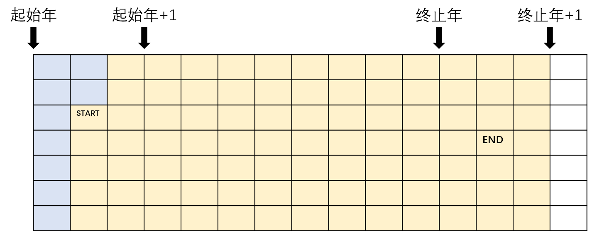
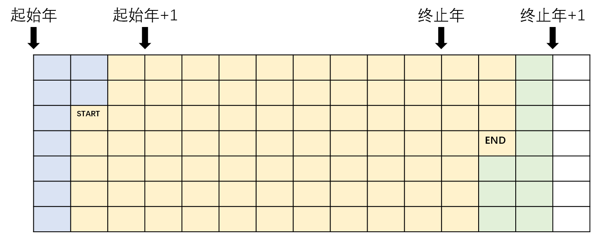

# 第二阶段编程练习6

本次作业略有难度，既需要对问题抽象和理解，同时也考察到了之前学习的字符串和多维数组的很多操作，此外完成时也需要考虑很多边界条件。

## 电池的寿命

该题目需要对问题进行仔细的分析，当完全理解后其实非常简单。题目要求仅仅需要输出使用的时间，而不需要给出明确的使用方案，因此并不需要细致地考虑如何分配使用电池。稍微思考就可以发现，最大的电池会限制使用时间。下面我们分情况讨论。

假设有n块电池，分别可以使用H1 > H2 > H3 > ... > Hn小时，此外H1 > H2 + H3 + ... + Hn。那么很显然，H1到底有多大是没有意义的，因为其他n-1块电池都没电了，H1还是有剩余的，这种情况下就会使得H1被浪费。这种情况下，n块电池可以使用H2 + H3 + ... + Hn小时。

同样假设有n块电池，但是此时H1 <= H2 + H3 + ... + Hn。这种情况下，总是可以找到至少一种方案，用其他电池来替换H1，从而使得所有电池都恰好用没电。参考题目描述中的方案即可。这种情况下，n块电池可以使用(H1 + H2 + ... + Hn) / 2小时。

按照上述方案编写程序即可。

## 计算两个日期之间的天数

直接遍历天数过于复杂，可以把整个问题简化为如下的三个阶段计算即可。

1. 只考虑年份，从起始年的第一天到终止年的最后一天经过了多少天；
2. 去除起始年中，起始月日之前的天数；
3. 去除终止年中，终止月日之后的天数。

举个例子，首先， 如下图，直接按年完成第一阶段，计算图中黄色的天数。


接下来，如下图，去除起始年之中，起始月日之前的天数（蓝色标出）。



最后，如下图，去除终止年之中，终止月日之后的天数（绿色标出）。



至此，完成天数统计。但是，还需要考虑边界条件的问题。在这里，还需要确定起始和终止年份相同时，这个解法是否正确。可以发现，这个解法在边界条件上是正确的。

除了上述的宏观的解法之外，还需要额外注意闰年的细节。求取一个年份是否是闰年的函数如下。

```cpp
bool is_leap(int year)
{
    if ((year % 4 == 0 && year % 100 != 0) || (year % 400 == 0))
        return true;
    else
        return false;
}
```

## 计算并输出杨辉三角的前n行

假设使用数组arr来存储和表示杨辉三角，则该arr的形式如下。

|Row index|Col 0|Col 1|Col 2|Col 3|Col 4|Col 5|...|
|-|-|-|-|-|-|-|-|-|
|0|1|
|1|1|1|
|2|1|2|1|
|3|1|3|3|1|
|4|1|4|6|4|1|
|5|1|5|10|10|5|1|
|...|

可以发现，每一行的首尾元素均为1，其余元素均由上一行计算得到。元素的递推公式如下。

```
arr[i][j] = 1, if j == 0 or j == i or i == 0
arr[i][j] = arr[i-1][j-1] + arr[i-1][j], if i > 0 and (j > 0 and j < i)
```

提供的代码进行了进一步的存储优化，使用了类似双缓冲区的方法。可以发现，其实没有必要将整个arr数组存储起来，逐行计算和输出时，只会使用当当前行（row = i）的上一行（row = i - 1）的信息，因此我们只需要存储上一行，并不断更新即可。另一方面，直接赋值更新一行中所有元素可能时间上比较复杂，因此我们可以采用双缓冲区的方法。

举个例子，在计算杨辉三角的第5行（对应arr中row = 5）时，第4行的信息存放在缓冲区cur中（本质是数组），计算的部分在缓冲区nxt中完成。那么整个计算过程如下。

|Tag|Col 0|Col 1|Col 2|Col 3|Col 4|Col 5|...|
|-|-|-|-|-|-|-|-|
|cur|1|4|6|4|1||
|nxt|1 (首位)|5 (1+4)|10 (4+6)|10 (6+4)|5 (4+1)|1 (末位)|

之后，将cur和nxt交换，此时已经计算完成的第5行放在cur中，之前的第4行已经不需要存储，因此将其抹除，用于nxt计算。计算过程如下。

|Tag|Col 0|Col 1|Col 2|Col 3|Col 4|Col 5|Col 6|...|
|-|-|-|-|-|-|-|-|-|
|nxt|1 (首位)|6 (1+5)|15 (5+10)|20 (10+10)|15 (10+5)|6 (5+1)|1 (末位)|
|cur|1|5|10|10|5|1|

如此交替进行便可用比较少的存储完成题目，在一些存储要求比较严严格的题目中可以考虑使用这一类方法进行优化。

## 简单的缩略语判断

类似第二阶段编程练习6中的字符串题目，我们可以使用字符串以'\0'结尾的特性来完成本题。我们使用到字符串（字符数组）abbr，以及字符指针str来处理输入的每一行数据。数组名和指针几乎可以视为一样的类型，本质上来说，它们都是地址，因此，abbr[i]和*(abbr+i)一样，都是在取abbr这字符串的第i个字符；同理，对于指针str来说也是一样的。

对于一行输入，首先我们按行将其读入abbr字符串中，str指向空（NULL），如下所示。

|abbr|Idx 0|Idx 1|Idx 2|Idx 3|Idx 4|Idx 5|Idx 6|Idx 7|Idx 8|Idx 9|...
|-|-|-|-|-|-|-|-|-|-|-|-|
||'A'|'B'|':'|'A'|'C'|'D'|'E'|'b'|'F'|'B'|...|
|**str** = NULL|

接下来，找到分隔的':'字符，将str指向':'的下一个地址，并将':'替换为'\0'，如下所示。此时若cout输出abbr和str，则会直接输出输入数据中的缩写和全写两部分。

|abbr|Idx 0|Idx 1|Idx 2|Idx 3|Idx 4|Idx 5|Idx 6|Idx 7|Idx 8|Idx 9|...
|-|-|-|-|-|-|-|-|-|-|-|-|
||'A'|'B'|'\0'|'A'|'C'|'D'|'E'|'b'|'F'|'B'|...|
|**str**||||↑|

最后，扫描str，判断是否能匹配abbr即可，算法如下。

```
若str的第i位前的子串能匹配abbr的第j位前的子串，则在第i位上
1. 若str[i] == '\0'，说明扫描结束
    1.1 str无法与abbr匹配，终止并返回不能匹配
2. 若str[i] == abbr[j]，则str的第i为能与abbr的第j位匹配
    2.1 i加一，j加一
    2.2 若abbr[j] == '\0'，则说明abbr已经与str完全匹配，终止并返回可以匹配
    2.3 否则继续扫描str
3. 否则str[i] != abbr[j]，即str的第i为不能与abbr的第j位匹配
    3.1 i加一，j不动，继续扫描str，寻找能与abbr[j]匹配的位置
```

需要额外说明的是，该题目依然存在边界条件，即abbr必须比str短，该条件可以直接进行判定。

## 字符串最大跨距

与上面一道题目相同，我们首先使用'\0'和指针的方法将输入数据处理为s、s1和s2三个字符串（字符数组/字符指针）。接下来，使用上面介绍的类似的匹配方法从左向右扫描s，找到第一个能匹配s1的子串，该子串结束的位置为_st-1；从右向左倒着扫描s，找到第一个能匹配s2的子串，该子串开始的位置为_end+1，如下所示。最后直接计算_end - _st + 1即可。

|s|||||||||s1|||s2|||
|-|-|-|-|-|-|-|-|-|-|-|-|-|-|-|
|'a'|'b'|'c'|'d'|'e'|'f'|'g'|'h'|'\0'|'b'|'c'|'\0'|'f'|'g'|'\0'|
||s1开始|s1结束|_st|_end|s2开始|s2结束|

该题目的边界条件是，_st和_end必须存在（即s必须能与s1和s2匹配），且_st不能在_end右侧（s1与s2在s上匹配到的子串不重叠），该边界条件需要在计算之前进行判断。